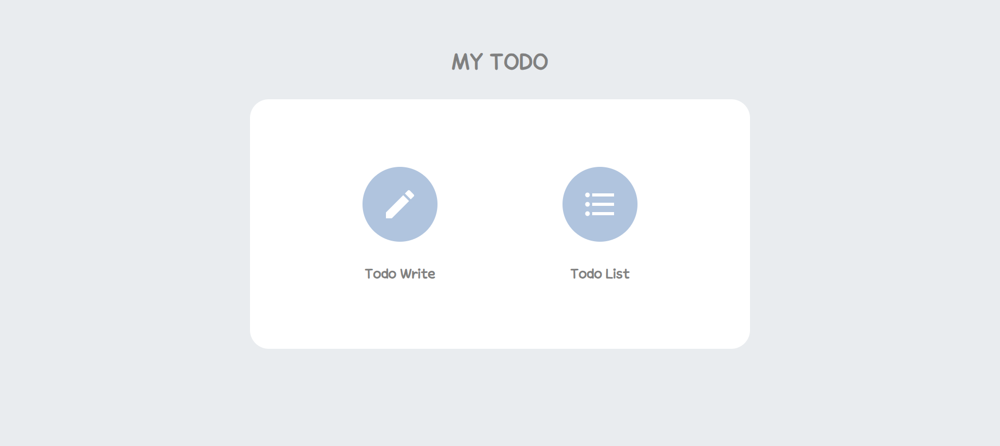
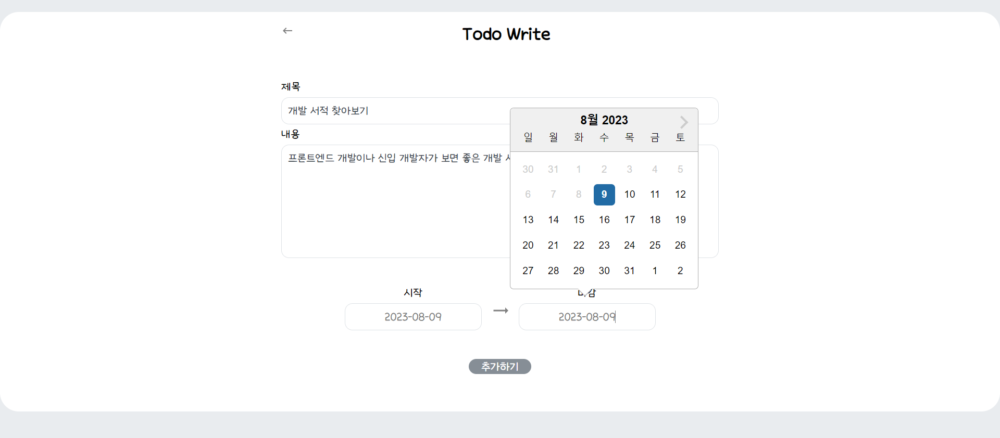
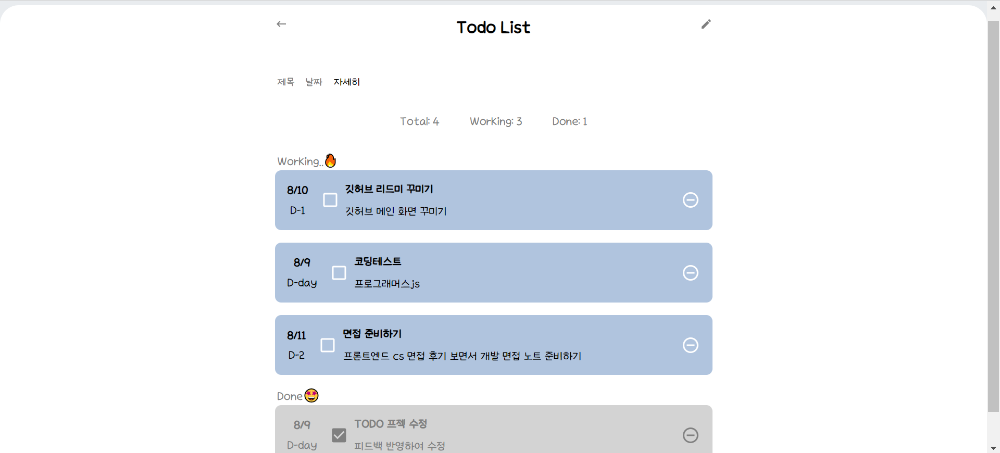
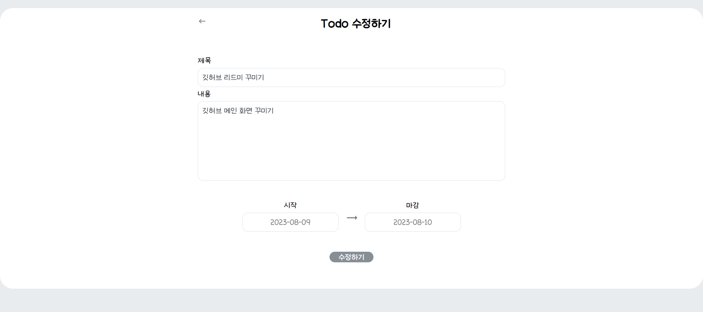

# 기본적인 CRUD 기능을 갖춘 기본적인 TODO
바로가기 > https://wonah-todo.netlify.app/

## preview

## 구조
App
- TodoMainPage
  - TodoInsertPage
    - TodoInsert
    - TodoEdit
  - TodoListPage
    - TodoList
      - TodoListItem
*** 
### 설치한 패키지 npm install
react-router-dom styled-components@5.3.11 styled-reset react-icons

> 리액트 단방향성 : 부모가 자식에게만 데이터 줄 수 있음

오류(해결): state 끌어올리기 해서 해결해야함 state 사용되는 공통된 최상위에 선언해야함 - App에 todos state 선언해야함

## 개발 일지
## 0612
Datepicker 라이브러리 사용

npm install react-datepicker --save

[디데이]

(TodoInsert) startDate, endDate state 로그
Thu Jun 15 2023 18:56:56 GMT+0900 (한국 표준시)

(TodoListItem) startDate, endDate state 로그
 undefined(오류): state 받아오질 않는 듯

## 0613
todo 전체 미완료 완료 개수
(오류) props 변경없이 페이지 이동만 했는데 완료 개수 초기화됨(재렌더링 되는 거 같음..)

페이지 이동 이전 상태 유지

todos에 id, text(-> title), content, date -> start, end, checked

새로운 객체 checked가 true인(Done) 따로 관리 -> working 밑에 done이 오도록

## 0614
0613 오류 수정
(오류) dday 계산

## 0615
0614 오류 수정
(오류) endDate state 기본값 new Date()로 오늘 날짜 받아오는데 
잘 받아오다가 getTime 오류 발생 콘솔 확인 -> endDate 날짜 받아오는데 string으로 변환되는 문제 발생 string이 오면 다시 object로 변경하면 될듯

## 0616
수정하기 기능 완료
0615 오류 수정 -> endDate object로 변경해서 다른 변수에 담음
(버그) 수정하기에서 제목 수정 안하면 다른 내용 수정해도 버튼 클릭x
따로 state로 상태 받지않고 각각 유효성 검사해야할듯

TodoEdit처럼 insert, list도 따로 page 없어도 됨 - 전달할 props 많아서 번거로움

(배포) build settings
build command CI=false run build

(권장)
enter 기능 key 속성
state 객체 하나로 관리

## 0617
todoListItem title/content text max length 한글 영어 차이

todoEdit Invalid time value, date string/object 관련된 문제인듯

todoInsert backIcon route path :  main -> list (end)

todoList listIcon delete (end)

d-day count result:  -- -> + & 0 -> D-day (end)

Working/Done count result : remove 반영되도록

app font-style

## 0808
todoInsert, todoEdit에서 마감 날짜보다 시작 날짜를 더 뒤로 설정했을때 유효성 검사 추가
  
Working/Done count result : remove 반영되도록 추가

font-style 추가

잘못된 폴더명 변경 : component -> components, page -> pages